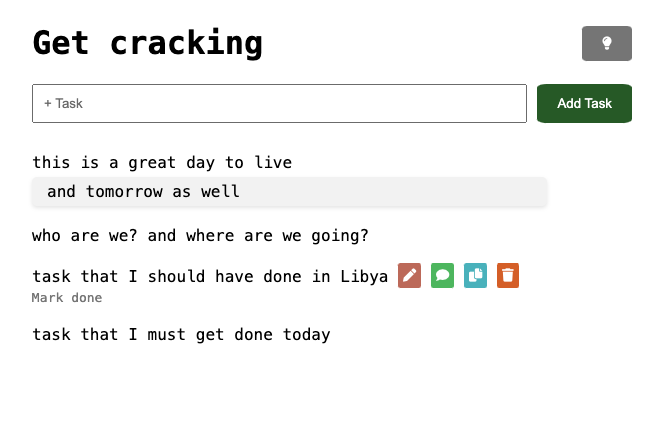
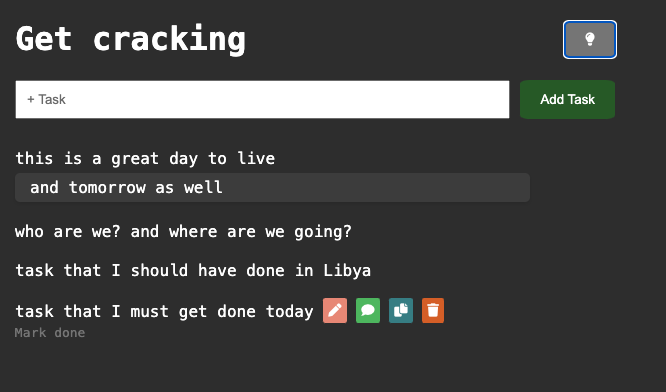

# Get Cracking
You can try it out live at: [https://getcracking.netlify.app/](https://getcracking.netlify.app/)

Features:
1. Add tasks (can press `Enter` to create)
2. Task completion (check off finished tasks)
3. Modify tasks (Edit)
4. Add notes to tasks for additional contexgt
5. Duplicate tasks
6. Delete tasks
7. Dark mode
8. Notes saved in local storage - can be used offline. Tasks do not need to be synced to the cloud

Future:
1. Additional snooze and notification functionality
2. Recurring tasks that can be set to create duplicates on a pre-defined schedule
3. Mobile-only swipe features to all task actions
4. TBD

Light Mode:

Dark Mode:

